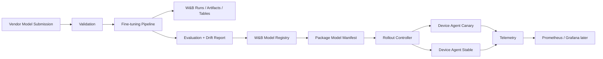

# model-port

[](https://github.com/ziwon/model-port/actions/workflows/ci.yaml)


A lightweight ModelOps gateway for multi-vendor AI model intake, fine-tuning, validation, registry promotion, and progressive rollout.

This scaffold is designed for a single RTX 5080 16GB workstation first, then can be extended to Kubernetes.

## Default demo track

- **Task**: small vision-language fine-tuning for edge/smart-glasses style image understanding
- **Base model**: `HuggingFaceTB/SmolVLM2-500M-Video-Instruct` by default; switch to `HuggingFaceTB/SmolVLM2-2.2B-Instruct` when memory allows
- **Dataset**: COCO-caption style subset or VQAv2-style subset
- **Fine-tuning**: LoRA / QLoRA-style PEFT
- **Tracking**: Weights & Biases for experiments, artifacts, tables, and drift/eval reports
- **Registry**: W&B Model Registry for model versions, aliases, tags, and lifecycle metadata
- **Deployment simulation**: canary rollout to local device agents

## Architecture



## Quickstart

```bash
python -m venv .venv
source .venv/bin/activate
pip install -U pip
pip install -e .[train,dev,api]
cp .env.example .env

# Optional
wandb login

# Prepare a tiny sample dataset
python scripts/prepare_sample_dataset.py --out data/sample_captions.jsonl --limit 64

# Run a dry-run vendor submission
python -m model_port.registry.vendor_submit --manifest configs/model_manifest.example.yaml

# Fine-tune / or dry-run if GPU deps are not installed
python -m model_port.pipelines.finetune --config configs/train.smolvlm.yaml --dry-run

# Evaluate and create drift report
python -m model_port.pipelines.evaluate --config configs/train.smolvlm.yaml --dry-run

# Register model metadata to the W&B Model Registry
python -m model_port.registry.wandb_register --manifest configs/model_manifest.example.yaml --dry-run
```

## Single-machine Compose

Run the local API, W&B, and trainer services on one machine:

```bash
just compose-up
```

- API: http://localhost:18080
- W&B: http://localhost:8081

If those ports are busy, override them in `.env` or inline:

```bash
MODEL_PORT_API_PORT=28080 WANDB_PORT=18081 just compose-up
```

Stop the stack with `just compose-down`.

Infrastructure notes live in [infra/](infra/README.md). For the MVP, the root
`compose.yaml` is intentionally the source of truth. The `infra/k8s/` directory
is reserved for the later k3s phase after the Compose lifecycle is stable.

### Local MLOps Flow

```bash
# Step 1. Local MLOps stack
just compose-up

# Step 1a. Optional GPU check for the trainer container
just trainer-gpu

# Step 2. Sample dataset contract: data -> train -> W&B -> eval -> registry -> manifest
just prepare-data

# Step 3. Fine-tuning run + W&B logging
just train

# Step 4. Evaluation / drift metrics
just evaluate

# Optional rollout-readiness check against the stricter edge policy
just evaluate-edge

# Step 5. W&B registry registration
just build-manifest
just register
just api-register
```

Run the full local path with `just local-mlops`.

If NVIDIA Container Toolkit is not available for Compose, keep W&B/API in Compose and run training on the host:

```bash
export WANDB_BASE_URL=http://127.0.0.1:8081
export WANDB_API_KEY=<local-wandb-api-key>
export WANDB_PROJECT=model-port

python -m model_port.pipelines.finetune --config configs/train.smolvlm.yaml
```

The sample dataset is a small JSONL file with local generated images:

```jsonl
{"image_path":"images/sample_001.jpg","prompt":"Describe this image.","answer":"A person is sitting at a desk with a laptop."}
```

Create it inside the trainer container with:

```bash
docker compose exec trainer python scripts/prepare_sample_dataset.py \
  --output data/sample_captions.jsonl \
  --num-samples 32
```

Evaluate base versus fine-tuned predictions and write a drift report:

```bash
docker compose exec trainer python -m model_port.pipelines.evaluate \
  --config configs/train.smolvlm.yaml \
  --model-dir artifacts/models/smolvlm2-caption-lora \
  --dataset data/sample_captions.jsonl \
  --output artifacts/eval/eval_report.json
```

Build a manifest from the evaluation report:

```bash
docker compose exec trainer python -m model_port.registry.build_manifest \
  --base configs/model_manifest.example.yaml \
  --eval-report artifacts/eval/eval_report.json \
  --output artifacts/manifests/vendor-demo-smart-captioner-0.1.0.yaml
```

Register the evaluated candidate with the API gateway:

```bash
curl -X POST http://127.0.0.1:18080/models/register \
  -H 'Content-Type: application/json' \
  -d '{
    "vendor": "vendor-demo",
    "model_name": "smart-captioner",
    "version": "0.1.0",
    "manifest_path": "artifacts/manifests/vendor-demo-smart-captioner-0.1.0.yaml",
    "stage": "candidate",
    "quality_gate_passed": false
  }'
```

Promotion is blocked when the quality gate failed:

```bash
curl -X POST http://127.0.0.1:18080/models/vendor-demo.smart-captioner.0.1.0/promote \
  -H 'Content-Type: application/json' \
  -d '{"target_stage":"staging"}'
```

Quality gates are profile-based. The default `cloud-sim` gate allows local Docker
VLM generation latency up to 3000ms p95 for development validation. The stricter
`edge-target` gate keeps a 100ms p95 target and a 500MB model-size target for
rollout planning. The current VLM candidate may pass the cloud simulation gate
but fail the strict edge-target latency gate; this demonstrates why model-port
separates model validation from production rollout.

When registration sees a failed evaluation report, the W&B model artifact keeps
the candidate lineage but adds rejection context. A latency failure is logged with
aliases like `candidate`, `rejected-latency`, and `v0.1.0`, plus metadata such as
`quality_gate_passed`, `reject_reason`, `p95_latency_ms`, `max_p95_latency_ms`,
`drift_score`, and `failure_rate`.

## Model Promotion Demo

### v0.1.0: Rejected

The first candidate completed evaluation but failed the strict edge target
latency gate.

| Metric | Value | Gate | Result |
|---|---:|---:|---|
| p95 latency | 2117.42 ms | 100 ms | Failed |
| failure rate | 0.0 | 0.01 | Passed |
| drift score | 0.0388 | 0.2 | Passed |

Promotion result:

```json
{
  "status": "blocked",
  "reason": "quality_gate_failed",
  "details": {
    "reject_reason": "p95_latency_ms_exceeded"
  }
}
```

### v0.1.1: Optimized Candidate

The second candidate reduces autoregressive generation length via the
`inference` config and evaluates against the cloud simulation gate:

```yaml
inference:
  max_new_tokens: 16
  do_sample: false
  num_beams: 1
  temperature: 0.0
```

Run the v0.1.1 evaluation and manifest build:

```bash
docker compose exec trainer python -m model_port.pipelines.evaluate \
  --config configs/train.smolvlm.v0.1.1.yaml \
  --model-dir artifacts/models/smolvlm2-caption-lora \
  --dataset data/sample_captions.jsonl \
  --output artifacts/eval/eval_report-v0.1.1.json \
  --version 0.1.1

docker compose exec trainer python -m model_port.registry.build_manifest \
  --base configs/model_manifest.example.yaml \
  --eval-report artifacts/eval/eval_report-v0.1.1.json \
  --output artifacts/manifests/vendor-demo-smart-captioner-0.1.1.yaml
```

Register the passing candidate in W&B with explicit aliases:

```bash
docker compose exec trainer python -m model_port.registry.wandb_register \
  --manifest artifacts/manifests/vendor-demo-smart-captioner-0.1.1.yaml \
  --eval-report artifacts/eval/eval_report-v0.1.1.json \
  --model-dir artifacts/models/smolvlm2-caption-lora \
  --aliases candidate,cloud-sim-passed,v0.1.1
```

Register and promote through the API:

```bash
curl -X POST http://127.0.0.1:18080/models/register \
  -H 'Content-Type: application/json' \
  -d '{
    "vendor": "vendor-demo",
    "model_name": "smart-captioner",
    "version": "0.1.1",
    "manifest_path": "artifacts/manifests/vendor-demo-smart-captioner-0.1.1.yaml",
    "stage": "candidate",
    "quality_gate_passed": true
  }'

curl -X POST http://127.0.0.1:18080/models/vendor-demo.smart-captioner.0.1.1/promote \
  -H 'Content-Type: application/json' \
  -d '{"target_stage":"staging"}'
```

Expected promotion result:

```json
{
  "status": "promoted",
  "from_stage": "candidate",
  "to_stage": "staging",
  "model": "vendor-demo.smart-captioner.0.1.1"
}
```

## Roadmap

- [ ] Real SmolVLM2 LoRA fine-tuning on RTX 5080
- [ ] W&B Tables for eval examples and output drift
- [ ] W&B model registry with aliases: `candidate`, `staging`, `production`
- [ ] FastAPI vendor model intake API
- [ ] ONNX/TFLite export placeholder
- [ ] Canary rollout controller
- [ ] Prometheus/Grafana device telemetry
- [ ] CI: lint, test, Docker build, Trivy scan, SBOM
