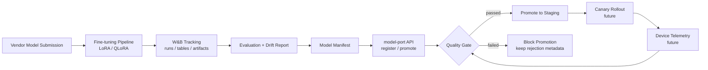
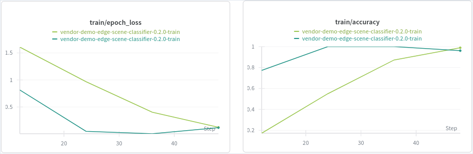

# model-port

[](https://github.com/ziwon/model-port/actions/workflows/ci.yaml)


A lightweight ModelOps gateway for multi-vendor AI model intake, fine-tuning, validation, registry promotion, and progressive rollout.

This scaffold is designed for a single RTX 5080 16GB workstation first, then can be extended to Kubernetes.

## Default demo track

- **Task**: small vision-language fine-tuning for edge/smart-glasses style image understanding
- **Base model**: `HuggingFaceTB/SmolVLM2-500M-Video-Instruct` by default; switch to `HuggingFaceTB/SmolVLM2-2.2B-Instruct` when memory allows
- **Dataset**: COCO-caption style subset or VQAv2-style subset
- **Fine-tuning**: LoRA / QLoRA-style PEFT
- **Tracking**: Weights & Biases for experiments, artifacts, tables, and drift/eval reports
- **Registry**: W&B Model Registry for model versions, aliases, tags, and lifecycle metadata
- **Deployment simulation**: canary rollout to local device agents

## Architecture

model-port is organized as a local-first ModelOps gateway.

It separates:

- experiment tracking from promotion control
- model evaluation from rollout decision
- vendor submission from production readiness
- cloud-simulation validation from strict edge-target validation


<details>
<summary>Mermaid source</summary>



</details>

## Quickstart

```bash
python -m venv .venv
source .venv/bin/activate
pip install -U pip
pip install -e .[train,dev,api]
cp .env.example .env

# Optional
wandb login

# Prepare a tiny sample dataset
python scripts/prepare_sample_dataset.py --out data/sample_captions.jsonl --limit 64

# Run a dry-run vendor submission
python -m model_port.registry.vendor_submit --manifest configs/model_manifest.example.yaml

# Fine-tune / or dry-run if GPU deps are not installed
python -m model_port.pipelines.finetune --config configs/train.smolvlm.yaml --dry-run

# Evaluate and create drift report
python -m model_port.pipelines.evaluate --config configs/train.smolvlm.yaml --dry-run

# Register model metadata to the W&B Model Registry
python -m model_port.registry.wandb_register --manifest configs/model_manifest.example.yaml --dry-run
```

## Single-machine Compose

Run the local API, W&B, and trainer services on one machine:

```bash
just compose-up
```

- API: http://localhost:18080
- W&B: http://localhost:8081

Check the API health endpoint with:

```bash
curl http://127.0.0.1:18080/healthz
```

If those ports are busy, override them in `.env` or inline:

```bash
MODEL_PORT_API_PORT=28080 WANDB_PORT=18081 just compose-up
```

Stop the stack with `just compose-down`.

Infrastructure notes live in [infra/](infra/README.md). For the MVP, the root
`compose.yaml` is intentionally the source of truth. The `infra/k8s/` directory
is reserved for the later k3s phase after the Compose lifecycle is stable.

### Local MLOps Flow

```bash
# Step 1. Local MLOps stack
just compose-up

# Step 1a. Optional GPU check for the trainer container
just trainer-gpu

# Step 2. Sample dataset contract: data -> train -> W&B -> eval -> registry -> manifest
just prepare-data

# Step 3. Fine-tuning run + W&B logging
just train

# Step 4. Evaluation / drift metrics
just evaluate

# Optional rollout-readiness check against the stricter edge policy
just evaluate-edge

# Step 5. W&B registry registration
just build-manifest
just register
just api-register
```

Run the full local path with `just local-mlops`.

If NVIDIA Container Toolkit is not available for Compose, keep W&B/API in Compose and run training on the host:

```bash
export WANDB_BASE_URL=http://127.0.0.1:8081
export WANDB_API_KEY=<local-wandb-api-key>
export WANDB_PROJECT=model-port

python -m model_port.pipelines.finetune --config configs/train.smolvlm.yaml
```

The sample dataset is a small JSONL file with local generated images:

```jsonl
{"image_path":"images/sample_001.jpg","prompt":"Describe this image.","answer":"A person is sitting at a desk with a laptop."}
```

Create it inside the trainer container with:

```bash
docker compose exec trainer python scripts/prepare_sample_dataset.py \
  --output data/sample_captions.jsonl \
  --num-samples 32
```

Evaluate base versus fine-tuned predictions and write a drift report:

```bash
docker compose exec trainer python -m model_port.pipelines.evaluate \
  --config configs/train.smolvlm.yaml \
  --model-dir artifacts/models/smolvlm2-caption-lora \
  --dataset data/sample_captions.jsonl \
  --output artifacts/eval/eval_report.json
```

The evaluation run logs sample predictions, latency, and pass/fail status to a
W&B Table for visual inspection:


Build a manifest from the evaluation report:

```bash
docker compose exec trainer python -m model_port.registry.build_manifest \
  --base configs/model_manifest.example.yaml \
  --eval-report artifacts/eval/eval_report.json \
  --output artifacts/manifests/vendor-demo-smart-captioner-0.1.0.yaml
```

Register the evaluated candidate with the API gateway:

```bash
curl -X POST http://127.0.0.1:18080/models/register \
  -H 'Content-Type: application/json' \
  -d '{
    "vendor": "vendor-demo",
    "model_name": "smart-captioner",
    "version": "0.1.0",
    "manifest_path": "artifacts/manifests/vendor-demo-smart-captioner-0.1.0.yaml",
    "stage": "candidate"
  }'
```

Promotion is blocked when the quality gate failed:

```bash
curl -X POST http://127.0.0.1:18080/models/vendor-demo.smart-captioner.0.1.0/promote \
  -H 'Content-Type: application/json' \
  -d '{"target_stage":"staging"}'
```

Quality gates are profile-based. The default `cloud-sim` gate allows local Docker
VLM generation latency up to 3000ms p95 for development validation. The stricter
`edge-target` gate keeps a 100ms p95 target and a 500MB model-size target for
rollout planning. The current VLM candidate may pass the cloud simulation gate
but fail the strict edge-target latency gate; this demonstrates why model-port
separates model validation from production rollout.

When registration sees a failed evaluation report, the W&B model artifact keeps
the candidate lineage but adds rejection context. A latency failure is logged with
aliases like `candidate`, `rejected-latency`, and `v0.1.0`, plus metadata such as
`quality_gate_passed`, `reject_reason`, `p95_latency_ms`, `max_p95_latency_ms`,
`drift_score`, and `failure_rate`.

model-port intentionally keeps failed candidates in the registry with rejection
metadata instead of deleting them. This preserves vendor lineage, evaluation
evidence, and promotion history for auditability.

Vendors cannot self-declare a model as passed. Promotion eligibility is derived
from `evaluation.passed` in the evaluated manifest. The MVP uses a local JSON
registry for transparency; production backends should use PostgreSQL, SQLite
with locking, or object storage with versioned writes.

## Model Promotion Demo

model-port does not blindly promote every model. Heavy VLMs can pass local
cloud-simulation validation but still fail a strict edge-target gate, while a
small edge-friendly model must still prove that it meets accuracy, drift,
latency, failure-rate, and model-size gates before it can move to staging.

The current demo has three promotion experiments:

- **Experiment 1: Heavy VLM candidate**: `smart-captioner` v0.1.0 is good for
  visual understanding, but fails the strict edge latency gate. Promotion is
  blocked.
- **Experiment 2: Scratch edge classifier**: `edge-object-classifier` with a
  scratch MobileNetV3 backbone passes latency and size gates, but fails accuracy
  and drift gates. Promotion is blocked.
- **Experiment 3: Pretrained edge classifier**: `edge-object-classifier` v0.3.0
  uses a pretrained MobileNetV3 backbone and a fine-tuned classifier head. It
  passes accuracy, latency, drift, failure-rate, and model-size gates, then moves
  from candidate to staging.

| Experiment | Model | Training Strategy | Accuracy | p95 Latency | Drift | Size | Gate Result | Promotion |
|---|---|---|---:|---:|---:|---:|---|---|
| v0.1.0 | `smart-captioner` | LoRA VLM fine-tuning | N/A | ~2117 ms | 0.0388 | adapter | Failed latency | Blocked |
| v0.2.x | `edge-object-classifier` | Scratch MobileNetV3 | 0.296 | ~5.47 ms | 0.34 | ~5.88 MB | Failed accuracy/drift | Blocked |
| v0.3.0 | `edge-object-classifier` | Pretrained MobileNetV3 + classifier head | 0.76 | 5.7473 ms | 0.142 | 5.9484 MB | Passed | Staging |

### Demo 1: VLM Candidate Rejected

`smart-captioner` v0.1.0 is a SmolVLM2 captioning candidate. It completes the
training and evaluation path, but the strict `edge-target` profile blocks
promotion because autoregressive VLM generation is too slow for the 100ms p95
edge latency target.

| Field | Value |
|---|---|
| Model | `smart-captioner` |
| Version | `0.1.0` |
| Type | VLM captioner |
| Gate | `edge-target` |
| Result | promotion blocked |
| Reason | `p95_latency_ms_exceeded` |

| Metric | Value | Gate | Result |
|---|---:|---:|---|
| p95 latency | 2117.42 ms | 100 ms | Failed |
| failure rate | 0.0 | 0.01 | Passed |
| drift score | 0.0388 | 0.2 | Passed |

Promotion result:

```json
{
  "status": "blocked",
  "reason": "quality_gate_failed",
  "details": {
    "reject_reason": "p95_latency_ms_exceeded"
  }
}
```

### Demo 2: Scratch Edge Classifier Rejected

`edge-object-classifier` v0.2.x is the first edge-friendly attempt. Instead of
forcing a VLM into an edge target, this candidate uses a small MobileNetV3-Small
classifier trained from scratch. The model is fast and small enough for the
`edge-target` profile, but the promotion gate still blocks it because accuracy
is too low and distribution drift is too high.

| Field | Value |
|---|---|
| Model | `edge-object-classifier` |
| Version | `0.2.x` |
| Type | scratch MobileNetV3-Small classifier |
| Gate | `edge-target` |
| Result | promotion blocked |
| Reason | accuracy and drift gates failed |

| Metric | Value | Gate | Result |
|---|---:|---:|---|
| accuracy | 0.296 | 0.55 minimum | Failed |
| p95 latency | 5.47 ms | 100 ms | Passed |
| failure rate | 0.0 | 0.01 | Passed |
| drift score | 0.34 | 0.3 | Failed |
| model size | 5.88 MB | 100 MB | Passed |

Promotion result:

```json
{
  "status": "blocked",
  "reason": "quality_gate_failed",
  "details": {
    "reject_reason": "accuracy_below_minimum"
  }
}
```

W&B training evidence:



The `train/epoch_loss` and `train/accuracy` panels show that the scratch
MobileNetV3-Small run trains, but the later evaluation still blocks promotion
because edge readiness requires accuracy and drift gates, not only low latency.

### Demo 3: Pretrained Edge Classifier Promoted

`edge-object-classifier` v0.3.0 keeps the same MobileNetV3-Small edge footprint
but switches to a pretrained backbone with a fine-tuned classifier head on a
balanced CIFAR-10 subset. This improves accuracy enough to pass the same
`edge-target` promotion policy while preserving low latency and small model
size.

| Field | Value |
|---|---|
| Model | `edge-object-classifier` |
| Version | `0.3.0` |
| Type | pretrained MobileNetV3-Small classifier |
| Gate | `edge-target` |
| Result | promoted to staging |
| Reason | accuracy, latency, failure rate, drift, and model size passed |

| Metric | Value | Gate | Result |
|---|---:|---:|---|
| accuracy | 0.76 | 0.55 minimum | Passed |
| p95 latency | 5.7473 ms | 100 ms | Passed |
| failure rate | 0.0 | 0.01 | Passed |
| drift score | 0.142 | 0.3 | Passed |
| model size | 5.9484 MB | 100 MB | Passed |

Promotion result:

```json
{
  "status": "promoted",
  "from_stage": "candidate",
  "to_stage": "staging",
  "model": "vendor-demo.edge-object-classifier.0.3.0"
}
```

### v0.1.1: Cloud-Sim Optimization

The second candidate reduces autoregressive generation length via the
`inference` config and evaluates against the `cloud-sim` gate. This is useful as
an optimization experiment, but it is not the final edge success case.

```yaml
inference:
  max_new_tokens: 16
  do_sample: false
  num_beams: 1
  temperature: 0.0
```

Run the v0.1.1 evaluation and manifest build:

```bash
docker compose exec trainer python -m model_port.pipelines.evaluate \
  --config configs/train.smolvlm.v0.1.1.yaml \
  --model-dir artifacts/models/smolvlm2-caption-lora \
  --dataset data/sample_captions.jsonl \
  --output artifacts/eval/eval_report-v0.1.1.json \
  --version 0.1.1

docker compose exec trainer python -m model_port.registry.build_manifest \
  --base configs/model_manifest.example.yaml \
  --eval-report artifacts/eval/eval_report-v0.1.1.json \
  --output artifacts/manifests/vendor-demo-smart-captioner-0.1.1.yaml
```

Register the passing candidate in W&B with explicit aliases:

```bash
docker compose exec trainer python -m model_port.registry.wandb_register \
  --manifest artifacts/manifests/vendor-demo-smart-captioner-0.1.1.yaml \
  --eval-report artifacts/eval/eval_report-v0.1.1.json \
  --model-dir artifacts/models/smolvlm2-caption-lora \
  --aliases candidate,cloud-sim-passed,v0.1.1
```

Register and promote through the API:

```bash
curl -X POST http://127.0.0.1:18080/models/register \
  -H 'Content-Type: application/json' \
  -d '{
    "vendor": "vendor-demo",
    "model_name": "smart-captioner",
    "version": "0.1.1",
    "manifest_path": "artifacts/manifests/vendor-demo-smart-captioner-0.1.1.yaml",
    "stage": "candidate"
  }'

curl -X POST http://127.0.0.1:18080/models/vendor-demo.smart-captioner.0.1.1/promote \
  -H 'Content-Type: application/json' \
  -d '{"target_stage":"staging"}'
```

## v0.3.0 Roadmap

v0.2.x validated the model-port lifecycle with an edge-classification candidate
that was fast and small but not accurate enough. v0.3.0 keeps the same promotion
contract, replaces the synthetic-only path with a balanced CIFAR-10 subset, and
uses transfer learning to produce a candidate that passes the edge gate.

Completed baseline scope:

- Balanced CIFAR-10 subset exported into the same JSONL + local image contract
  as the earlier synthetic dataset.
- Pretrained MobileNetV3-Small backbone with a fine-tuned classifier head.
- Edge-target evaluation for accuracy, p95 latency, failure rate, drift score,
  and model size.
- Manifest generation, W&B registry logging, API registration, and promotion
  from candidate to staging.

Next scope:

- Add a deterministic dataset split file so train/eval results are reproducible
  across machines and W&B runs.
- Export the promoted classifier to ONNX, then evaluate both PyTorch and ONNX
  latency under the same `edge-target` quality gate.
- Add quantization-aware or post-training quantization experiments and compare
  `model_size_mb`, `p95_latency_ms`, and accuracy drop.
- Extend the manifest with runtime targets, for example `torchvision`, `onnx`,
  and future `tflite`.
- Add a rollout simulation that assigns a canary percentage and records rollback
  metadata after staging promotion.
- Move registry persistence from local JSON toward SQLite as the bridge between
  the Compose MVP and the later k3s/Helm deployment.

Current demo outcome:

```text
v0.1.0: VLM candidate rejected by edge-target latency
v0.2.x: scratch edge classifier rejected by accuracy and drift gates
v0.3.0: pretrained public-dataset edge classifier promoted to staging
```

Initial v0.3.0 preparation uses a balanced CIFAR-10 subset exported into the
same JSONL + local image contract as v0.2.0:

```bash
just prepare-cifar10-data
just train-v030
just evaluate-v030
just build-manifest-v030
just register-v030
just api-register-v030
just promote-v030
```

The v0.3.0 target is not a production-grade CIFAR-10 benchmark. It is a
public-dataset promotion experiment that proves the same gateway lifecycle can
block a weak scratch model and promote an improved transfer-learning candidate.
ONNX export and quantized runtime comparison are the next implementation steps
after this baseline.

## Roadmap

- [x] W&B Tables for eval examples and output drift
- [x] Heavy VLM rejection demo
- [x] Scratch edge classifier rejection demo
- [x] Public-dataset pretrained edge classifier v0.3.0 promotion demo
- [ ] W&B model registry with aliases: `candidate`, `staging`, `production`
- [ ] ONNX export and latency comparison
- [ ] Quantized edge-runtime comparison
- [ ] SQLite registry backend for local production simulation
- [ ] Real SmolVLM2 LoRA fine-tuning on RTX 5080
- [ ] FastAPI vendor model intake API
- [ ] Canary rollout controller
- [ ] Prometheus/Grafana device telemetry
- [ ] CI: lint, test, Docker build, Trivy scan, SBOM
