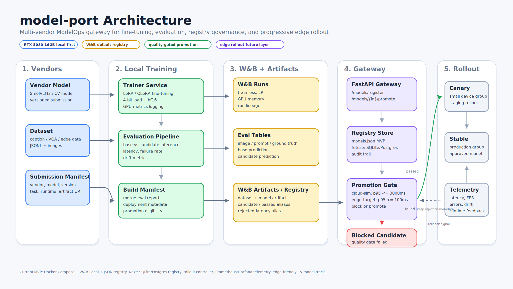
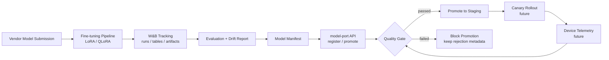
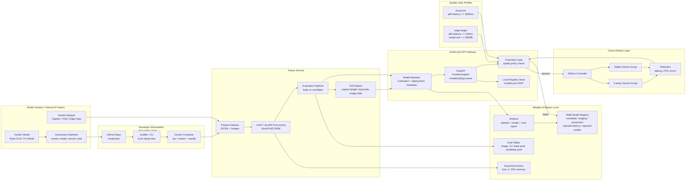
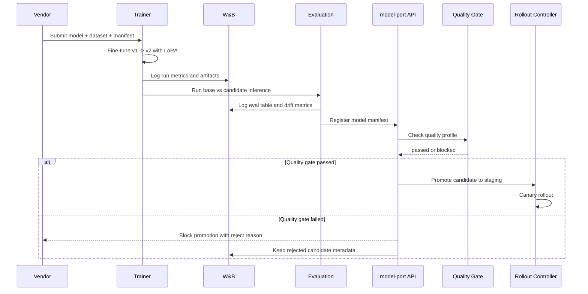

# Architecture

model-port is organized as a local-first ModelOps gateway.

It separates:

- experiment tracking from promotion control
- model evaluation from rollout decision
- vendor submission from production readiness
- cloud-simulation validation from strict edge-target validation

## Lifecycle

The lifecycle starts with a submitted model and ends with a governed promotion
decision. Each step produces an artifact that the next step can verify: training
produces a candidate, evaluation produces a report, the manifest captures the
candidate state, and the API applies the quality gate before rollout.

## Detailed View

The detailed view expands the local MVP into the components that own each part
of the model lifecycle. The current implementation runs on Docker Compose, but
the boundaries are intentionally close to the future k3s or Kubernetes shape:
trainer, tracking, registry gateway, policy, and rollout remain separate
concerns.

The vendor boundary represents external vendors or internal model teams. They
provide a model, dataset reference, and submission manifest, but they do not
control promotion status.

The developer workstation boundary is the MVP runtime. `Justfile` commands and
Docker Compose wire together the API, trainer, and W&B services so the full
pipeline can be exercised on one machine before moving to k3s.

The trainer service owns data preparation, LoRA or QLoRA fine-tuning, and
evaluation execution. It produces artifacts and reports, but avoids making
rollout decisions directly.

W&B is the default experiment and artifact system. It stores training runs,
evaluation tables, model artifacts, lifecycle aliases, and rejection metadata so
both blocked and promoted candidates remain auditable. The MVP uses aliases such
as `candidate`, `staging`, `production`, `rejected-latency`, and
`rejected-quality`.

The model-port API gateway owns registration and promotion control. It reads
the evaluated manifest, persists a local registry record, and blocks promotion
when the quality gate fails.

Quality gate profiles separate development validation from strict edge targets.
For example, `cloud-sim` can validate that the pipeline and model behavior are
reasonable, while `edge-target` can block candidates that are too slow or too
large for deployment.

The rollout layer is future-facing in the MVP. It sketches where canary rollout,
stable rollout, runtime telemetry, and feedback into later quality decisions
will live.

## Runtime Sequence

The runtime sequence shows the promotion path as a control loop, not just a
training job. Training and evaluation produce evidence, while the API and
quality gate decide whether the model can move forward.

1. Vendor submission provides the base model, dataset reference, and manifest
   metadata. The manifest identifies the vendor, model name, version, task, and
   runtime contract.
2. The trainer owns fine-tuning and experiment logging. It writes run metrics,
   model artifacts, and lineage to W&B, but it does not decide production
   readiness.
3. Evaluation compares the base model and candidate model on the same dataset.
   It records latency, failure rate, drift metrics, and sample predictions in
   W&B tables.
4. The evaluated manifest becomes the handoff contract to the model-port API.
   Promotion eligibility is derived from the manifest evaluation section.
5. The quality gate applies a named profile such as `cloud-sim` or
   `edge-target`. A passing result can move to staging; a failing result blocks
   promotion and preserves rejection metadata.
6. The rollout controller is intentionally future-facing in the MVP. It
   represents the next layer for canary rollout, runtime telemetry, and feedback
   into later quality gate decisions.

## Governance

Vendors cannot self-declare a model as passed. Promotion eligibility is derived
from the evaluated manifest, specifically `evaluation.passed`.

Failed candidates remain in the registry with rejection metadata. This preserves
vendor lineage, evaluation evidence, and promotion history for auditability.
