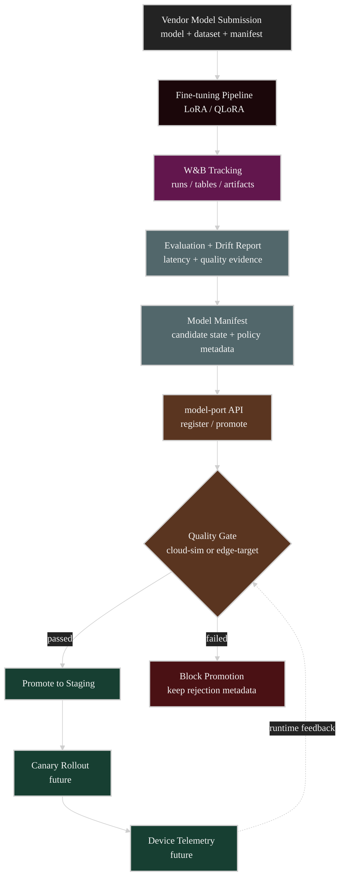
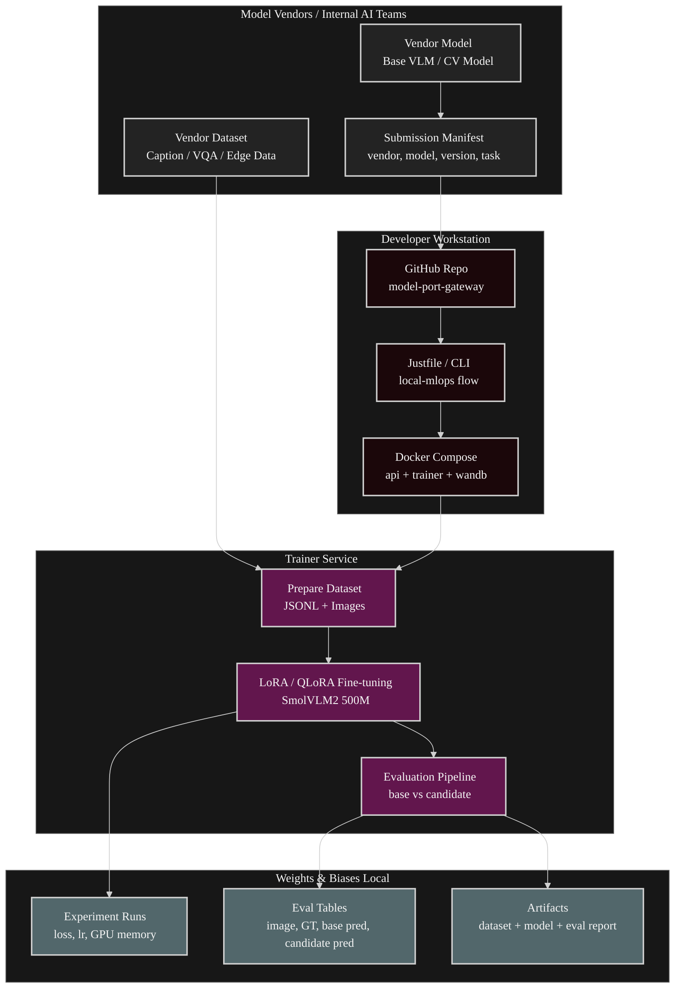
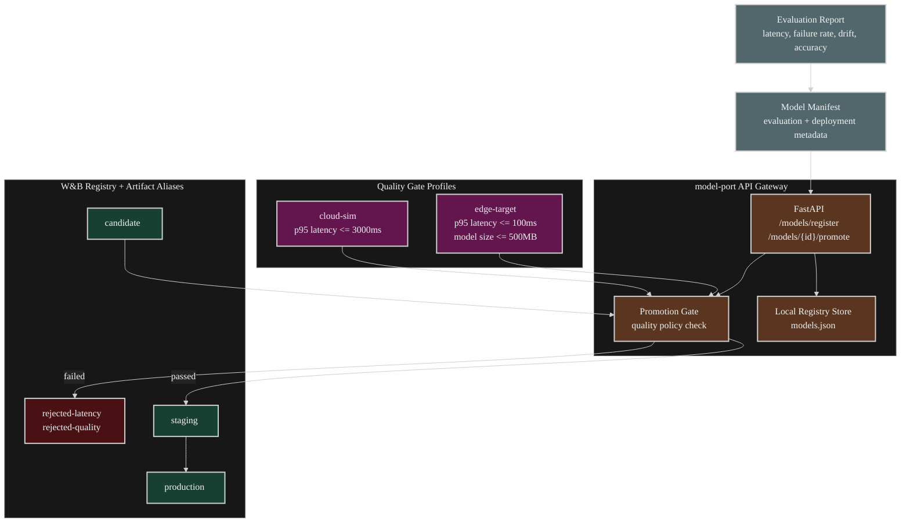
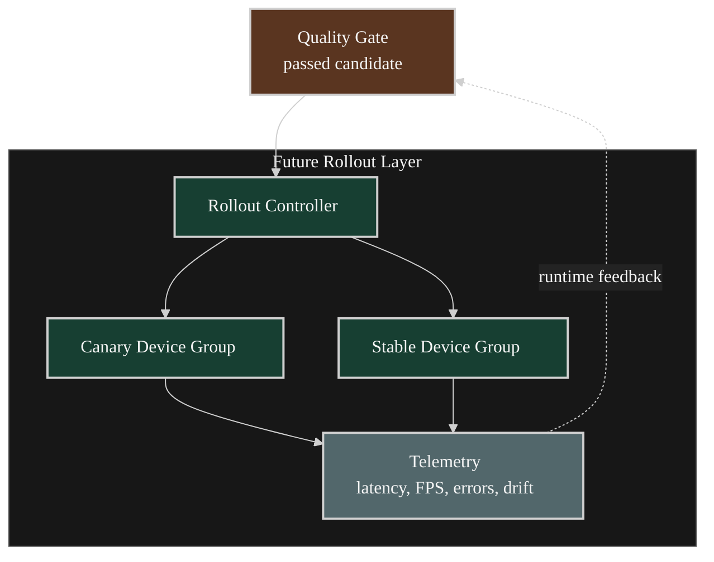
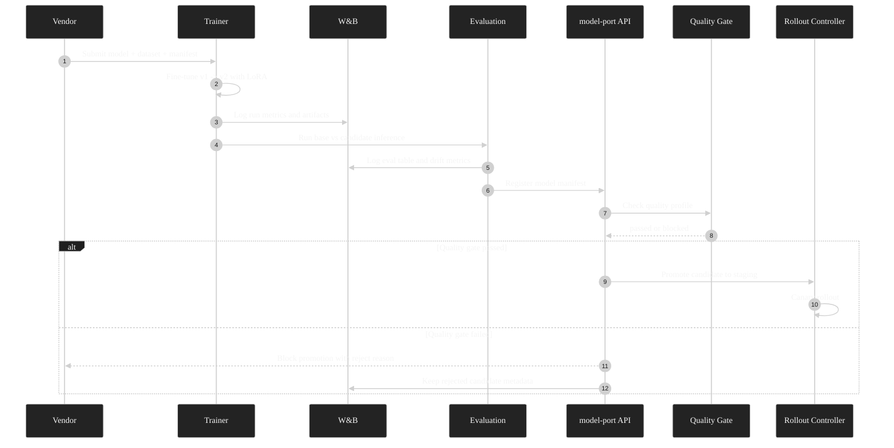

# Architecture

model-port is organized as a local-first ModelOps gateway.

It separates:

- experiment tracking from promotion control
- model evaluation from rollout decision
- vendor submission from production readiness
- cloud-simulation validation from strict edge-target validation

## Lifecycle

The lifecycle starts with a submitted model and ends with a governed promotion
decision. Each step produces an artifact that the next step can verify: training
produces a candidate, evaluation produces a report, the manifest captures the
candidate state, and the API applies the quality gate before rollout.

## Detailed View

The detailed view is split into smaller diagrams so each boundary remains
readable in GitHub. The same ownership model applies across all views: training
produces evidence, W&B stores experiment and artifact lineage, and the gateway
owns promotion control.

### Local Execution

The local execution view shows what runs on a single developer machine. Vendor
inputs enter through a manifest and dataset reference, then the local Compose
stack wires the trainer and W&B services together.

Vendor and internal model teams provide inputs, but they do not control model
status. The trainer owns data preparation, fine-tuning, and evaluation
execution, while W&B records run metrics, prediction tables, and artifacts.

### Promotion Control

The promotion control view is the core gateway path. Evaluation output becomes
a manifest, the API persists a registry record, and quality profiles decide
whether the candidate can move forward.

The API is the promotion authority. It reads the evaluated manifest and blocks
promotion when the selected quality profile fails. W&B aliases keep lifecycle
state visible even for rejected candidates.

### Rollout Feedback

The rollout feedback view is future-facing. It shows where staging promotion
would hand off to canary rollout, how stable rollout follows, and how runtime
telemetry feeds later quality decisions.

This layer is not required for the current local runtime, but the boundary is
kept explicit so the Compose implementation can evolve toward k3s or Kubernetes
without mixing training, registry, and rollout responsibilities.

## Runtime Sequence

The runtime sequence shows the promotion path as a control loop, not just a
training job. Training and evaluation produce evidence, while the API and
quality gate decide whether the model can move forward.

1. Vendor submission provides the base model, dataset reference, and manifest
   metadata. The manifest identifies the vendor, model name, version, task, and
   runtime contract.
2. The trainer owns fine-tuning and experiment logging. It writes run metrics,
   model artifacts, and lineage to W&B, but it does not decide production
   readiness.
3. Evaluation compares the base model and candidate model on the same dataset.
   It records latency, failure rate, drift metrics, and sample predictions in
   W&B tables.
4. The evaluated manifest becomes the handoff contract to the model-port API.
   Promotion eligibility is derived from the manifest evaluation section.
5. The quality gate applies a named profile such as `cloud-sim` or
   `edge-target`. A passing result can move to staging; a failing result blocks
   promotion and preserves rejection metadata.
6. The rollout controller is intentionally future-facing in the local reference
   runtime. It
   represents the next layer for canary rollout, runtime telemetry, and feedback
   into later quality gate decisions.

## Governance

Vendors cannot self-declare a model as passed. Promotion eligibility is derived
from the evaluated manifest, specifically `evaluation.passed`.

Stage transitions are constrained to `candidate -> staging -> production`.
Candidates cannot skip directly to production, and production is treated as a
terminal stage. Rollback should be represented as a new candidate or a separate
future rollback workflow, not as an unrestricted stage mutation.

Failed candidates remain in the registry with rejection metadata. This preserves
vendor lineage, evaluation evidence, and promotion history for auditability.
