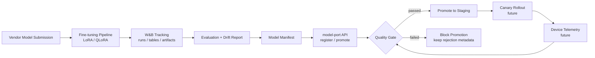
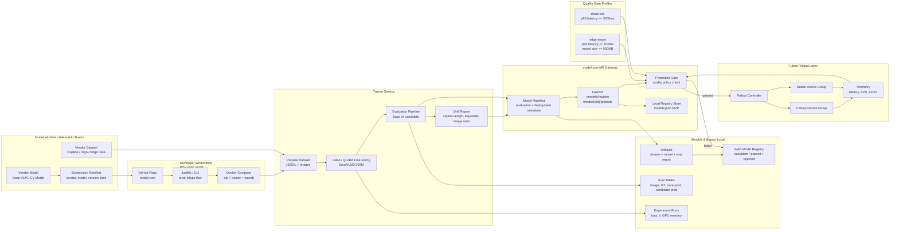

# Architecture

model-port is organized as a local-first ModelOps gateway.

It separates:

- experiment tracking from promotion control
- model evaluation from rollout decision
- vendor submission from production readiness
- cloud-simulation validation from strict edge-target validation

## Lifecycle

## Detailed View

## Governance

Vendors cannot self-declare a model as passed. Promotion eligibility is derived
from the evaluated manifest, specifically `evaluation.passed`.

Failed candidates remain in the registry with rejection metadata. This preserves
vendor lineage, evaluation evidence, and promotion history for auditability.
